# MobileSAM on Lensi: verification report

Generated by `tools/sam/evaluate.py`. Reference = MobileSAM's own `SamPredictor` (unpatched model, fp32) on the original image. The app pipeline is the one `SAMSegmenter.swift` runs: long side resized to 1024, top-left on a mean-colour (124,116,104) canvas, `LensiSAMEncoder` -> `LensiSAMDecoder` with 5 prompt slots -> mask choice -> `sam_common.mask_to_polygon`.

Tint = SAM's full-resolution mask (reference), yellow line = the app's simplified polygon, green/red dots = positive/negative clicks, cyan = box prompt.

## Summary

- Prompts: 25 on 11 images.
- Decoder wrapper vs SamPredictor on the same embedding: worst max|logit diff| 0.00e+00, worst mask IoU 1.0000, worst score diff 0.00e+00.
- Traced encoder vs eager: max diff 0.0e+00. App canvas (rounded mean padding) vs SamPredictor's exact zero padding: worst embedding max|diff| 0.0032.
- App pipeline in fp32 (canvas -> encoder -> decoder) vs SamPredictor: worst mask IoU 0.9992, worst score diff 0.0002.
- Converted Core ML programs, executed by `mil_check.py` with float16 storage: worst mask IoU vs SamPredictor 0.9795, worst score diff 0.0269, worst embedding correlation 0.999989, worst 64x64 fixture-style IoU vs fp32 0.9630; mask choice differs from fp32 on 0 prompt(s).
- float16 hazards found in the converted graphs: none (no overflow, no non-finite values, all partial-sum bounds < 65504).
- Plain ONNX padding (every -1 slot visible) vs SamPredictor: worst mask IoU 0.2222. That is why `LensiSAMDecoder` hides surplus padding slots.
- Outline (app polygon vs SAM's full-res mask): median IoU 0.966, worst 0.662; largest contour before simplification: median 0.981. Median 31 vertices.
- Resize filter sensitivity (the phone resizes with Core Graphics, not Pillow bilinear): a Lanczos canvas moves the chosen mask by IoU 0.994 median; lowest groceries / tail light 0.787, street / bicycle 0.893. That is SAM's own sensitivity on ambiguous or thin objects, not a conversion error (float16 worst is 0.979), and phone outlines can differ from this report by that much on such prompts.

## Notes

- One polygon per mask: the largest region's outer boundary. Holes are filled and smaller regions dropped, which is what the two low outline IoUs are: truck / tyre (the hub the negative click cut out is filled back in) and palace / red bus (a palm trunk splits the bus and only the larger part is outlined). The contour column is the same outline before simplification, so contour minus outline is the cost of the 0.3%-of-perimeter Douglas-Peucker step.
- The coreml16 column runs the converted programs op by op in numpy with every float16 intermediate rounded to float16 (`mil_check.py`). That models fp16 storage, not the Neural Engine's own arithmetic; `verify_coreml.py` on macOS is the real check.
- The masks are tinted from SamPredictor's output, so a gap between tint and yellow line is postprocessing, not model error.

## Timings (median, CPU, PyTorch fp32, 4 threads on the Linux build box; not iPhone numbers)

| step | ms |
|---|---|
| preprocess (resize + pad) | 17 |
| encoder (traced wrapper) | 279 |
| decoder (traced wrapper) | 24 |
| postprocess (mask -> polygon) | 4 |
| SamPredictor.set_image (resize + encoder) | 355 |
| encoder (mil_check fp16 interpreter) | 12755 |
| decoder (mil_check fp16 interpreter) | 424 |

## Per prompt

IoUs are on the 256x256 low-res mask at SamPredictor's chosen index unless noted; outline IoU is the app polygon rasterised at full resolution vs SAM's full-res mask.

| image | prompt | mask | score | area | pts | outline IoU | contour IoU | decoder max\|d\| | app fp32 IoU | coreml16 IoU | coreml16 d score | onnx-pad IoU | Lanczos IoU |
|---|---|---|---|---|---|---|---|---|---|---|---|---|---|
| truck | [window](truck_window.jpg) | 1 (multimask) | 0.995 | 1.0% | 26 | 0.962 | 0.962 | 0.0e+00 | 1.0000 | 1.0000 | 0.0002 | 0.989 | 0.994 |
| truck | [door](truck_door.jpg) | 2 (multimask) | 0.980 | 5.7% | 43 | 0.979 | 0.981 | 0.0e+00 | 1.0000 | 0.9984 | 0.0004 | 0.985 | 0.972 |
| truck | [wheel box](truck_wheel-box.jpg) | 0 (single) | 0.967 | 1.9% | 30 | 0.982 | 0.981 | 0.0e+00 | 1.0000 | 0.9988 | 0.0003 | 0.991 | 0.993 |
| truck | [tyre: box + bg point on hub](truck_tyre-box--bg-point-on-hub.jpg) | 0 (single) | 0.905 | 1.3% | 28 | 0.662 | 0.661 | 0.0e+00 | 1.0000 | 1.0000 | 0.0004 | 0.907 | 0.980 |
| dog | [dog](dog_dog.jpg) | 2 (multimask) | 1.008 | 17.9% | 23 | 0.984 | 0.992 | 0.0e+00 | 1.0000 | 0.9999 | 0.0004 | 0.999 | 0.999 |
| dog | [bowl](dog_bowl.jpg) | 1 (multimask) | 0.950 | 0.2% | 30 | 0.928 | 0.928 | 0.0e+00 | 1.0000 | 1.0000 | 0.0028 | 0.946 | 1.000 |
| groceries | [paper bag](groceries_paper-bag.jpg) | 1 (multimask) | 0.993 | 2.6% | 30 | 0.987 | 0.986 | 0.0e+00 | 1.0000 | 1.0000 | 0.0009 | 0.998 | 1.000 |
| groceries | [tail light](groceries_tail-light.jpg) | 1 (multimask) | 0.974 | 2.2% | 21 | 0.966 | 0.979 | 0.0e+00 | 1.0000 | 1.0000 | 0.0019 | 0.738 | 0.787 |
| bus | [person left](bus_person-left.jpg) | 2 (multimask) | 0.996 | 3.2% | 30 | 0.976 | 0.983 | 0.0e+00 | 1.0000 | 1.0000 | 0.0002 | 0.988 | 0.997 |
| bus | [person middle](bus_person-middle.jpg) | 3 (multimask) | 0.986 | 3.8% | 31 | 0.968 | 0.980 | 0.0e+00 | 1.0000 | 0.9995 | 0.0004 | 0.991 | 0.997 |
| bus | [bus box](bus_bus-box.jpg) | 0 (single) | 0.971 | 29.6% | 45 | 0.965 | 0.992 | 0.0e+00 | 0.9998 | 0.9993 | 0.0005 | 0.962 | 0.991 |
| bus | [bus: two points](bus_bus-two-points.jpg) | 0 (single) | 0.866 | 28.9% | 42 | 0.962 | 0.986 | 0.0e+00 | 0.9992 | 0.9973 | 0.0064 | 0.222 | 0.985 |
| zidane | [left man's head](zidane_left-man-s-head.jpg) | 2 (multimask) | 0.962 | 4.0% | 31 | 0.986 | 0.987 | 0.0e+00 | 1.0000 | 1.0000 | 0.0038 | 0.998 | 0.997 |
| zidane | [right man: head + jacket](zidane_right-man-head--jacket.jpg) | 0 (single) | 0.996 | 20.0% | 30 | 0.980 | 0.990 | 0.0e+00 | 1.0000 | 1.0000 | 0.0005 | 0.989 | 0.999 |
| neon | [guitar sign](neon_guitar-sign.jpg) | 1 (multimask) | 0.931 | 0.2% | 47 | 0.958 | 0.958 | 0.0e+00 | 1.0000 | 1.0000 | 0.0008 | 0.957 | 0.993 |
| neon | [boot sign](neon_boot-sign.jpg) | 3 (multimask) | 0.911 | 5.0% | 40 | 0.974 | 0.986 | 0.0e+00 | 1.0000 | 0.9991 | 0.0015 | 0.949 | 0.983 |
| palace | [clock tower](palace_clock-tower.jpg) | 2 (multimask) | 0.891 | 2.9% | 34 | 0.947 | 0.976 | 0.0e+00 | 1.0000 | 0.9979 | 0.0045 | 0.954 | 0.975 |
| palace | [red bus](palace_red-bus.jpg) | 2 (multimask) | 0.959 | 1.5% | 29 | 0.684 | 0.687 | 0.0e+00 | 1.0000 | 0.9980 | 0.0059 | 0.956 | 0.992 |
| street | [car](street_car.jpg) | 2 (multimask) | 0.986 | 2.4% | 21 | 0.960 | 0.962 | 0.0e+00 | 1.0000 | 1.0000 | 0.0003 | 0.988 | 0.997 |
| street | [bicycle](street_bicycle.jpg) | 2 (multimask) | 0.911 | 1.0% | 38 | 0.903 | 0.901 | 0.0e+00 | 1.0000 | 0.9795 | 0.0269 | 0.876 | 0.893 |
| corgi | [corgi](corgi_corgi.jpg) | 2 (multimask) | 1.001 | 8.8% | 42 | 0.972 | 0.981 | 0.0e+00 | 1.0000 | 1.0000 | 0.0001 | 0.998 | 0.998 |
| bears | [mother bear](bears_mother-bear.jpg) | 3 (multimask) | 1.019 | 15.3% | 47 | 0.976 | 0.989 | 0.0e+00 | 1.0000 | 0.9999 | 0.0006 | 0.994 | 0.998 |
| bears | [cub](bears_cub.jpg) | 3 (multimask) | 1.017 | 15.2% | 46 | 0.978 | 0.990 | 0.0e+00 | 1.0000 | 0.9999 | 0.0008 | 0.996 | 0.999 |
| horses | [white horse](horses_white-horse.jpg) | 2 (multimask) | 0.969 | 5.2% | 46 | 0.949 | 0.972 | 0.0e+00 | 1.0000 | 1.0000 | 0.0013 | 0.973 | 0.989 |
| horses | [brown horse](horses_brown-horse.jpg) | 2 (multimask) | 0.987 | 4.9% | 37 | 0.951 | 0.970 | 0.0e+00 | 1.0000 | 1.0000 | 0.0003 | 0.941 | 0.994 |

## Overlays

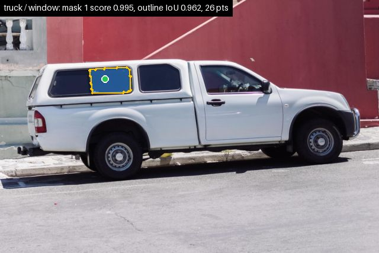
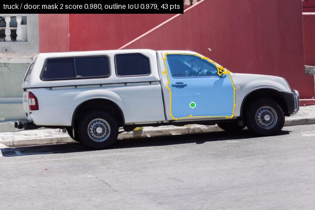
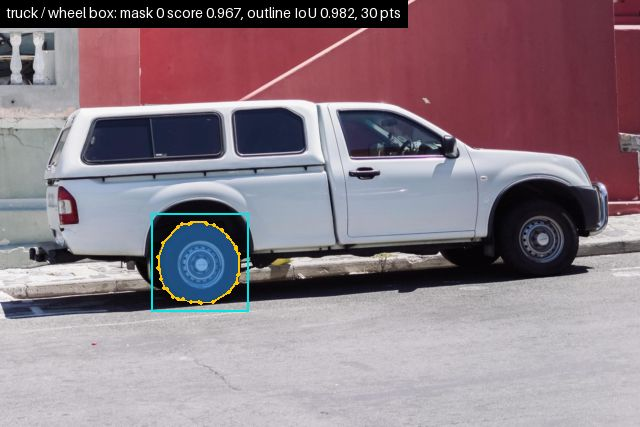
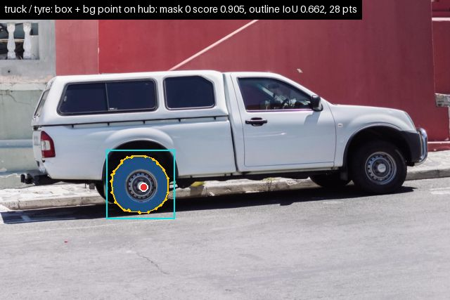
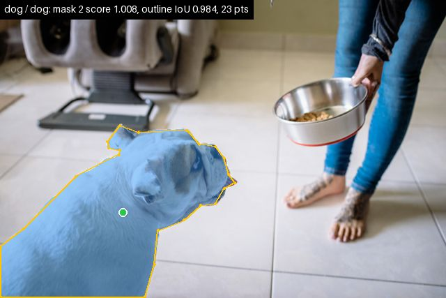
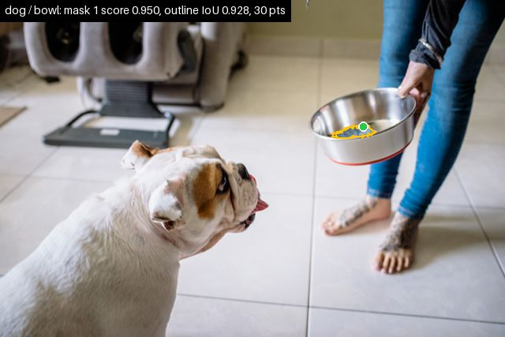
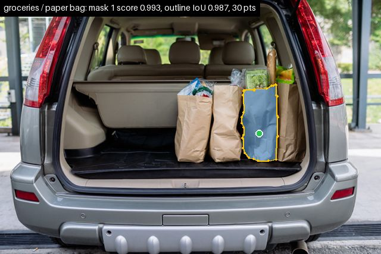
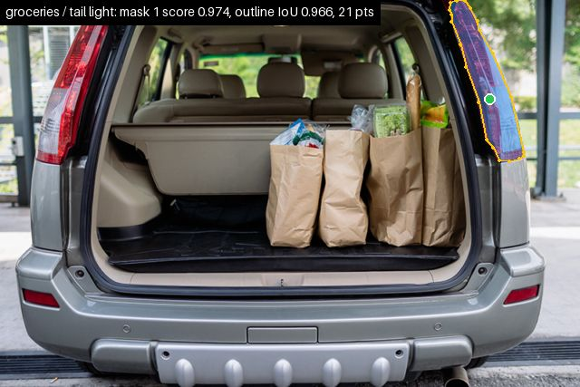
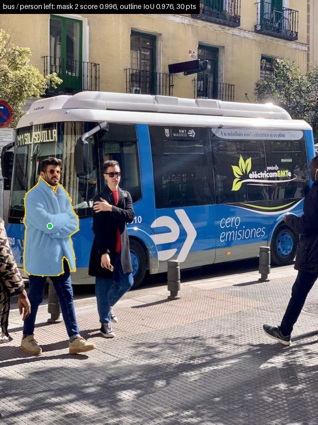
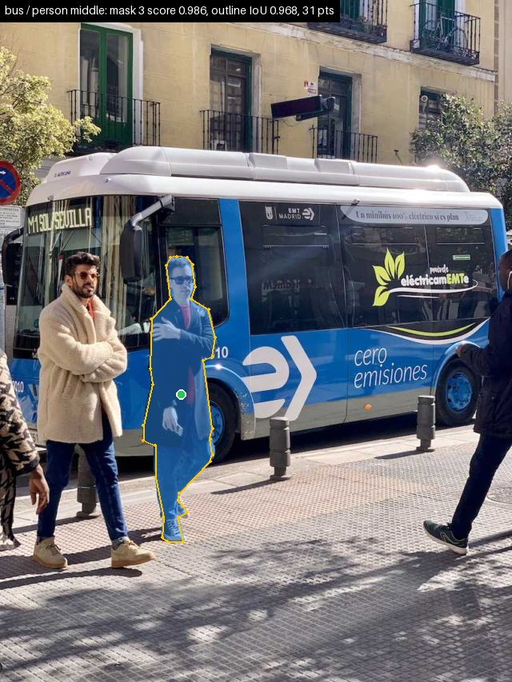
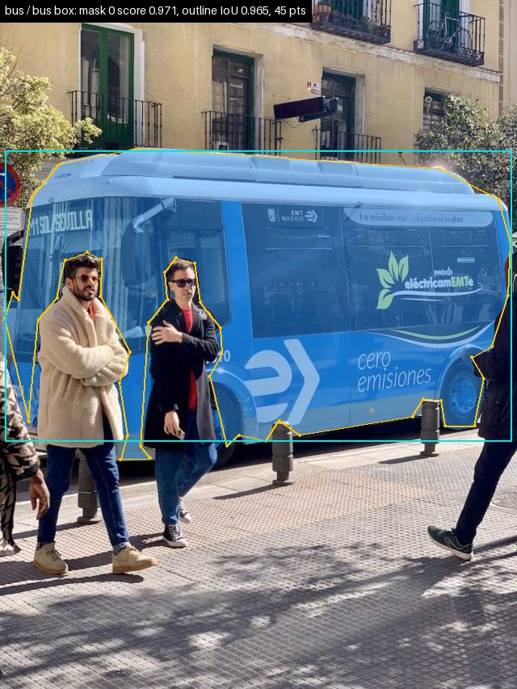
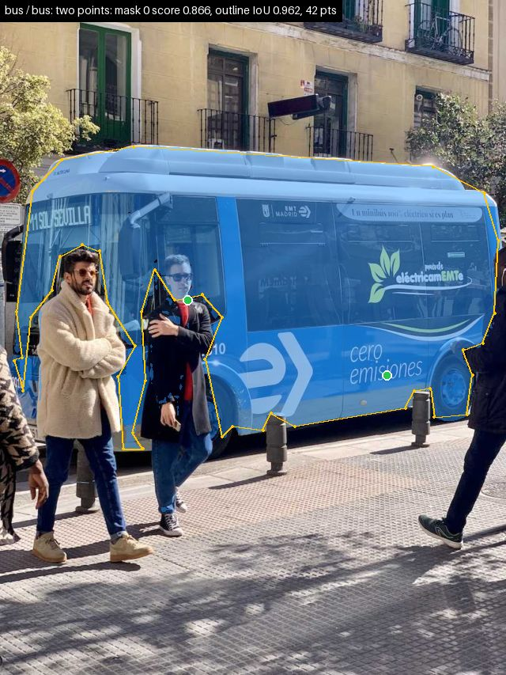
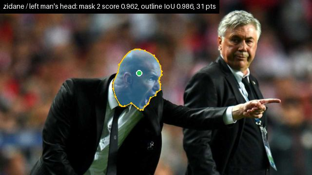
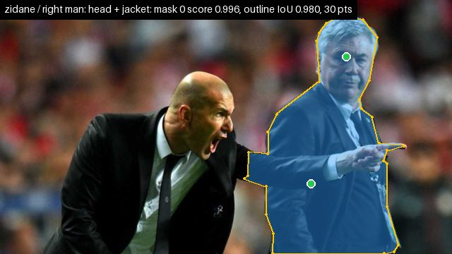
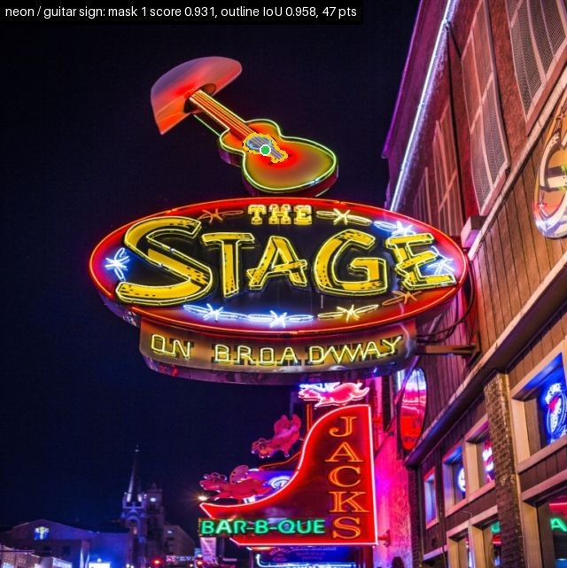
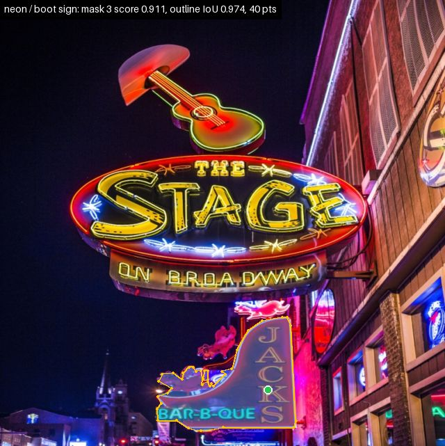
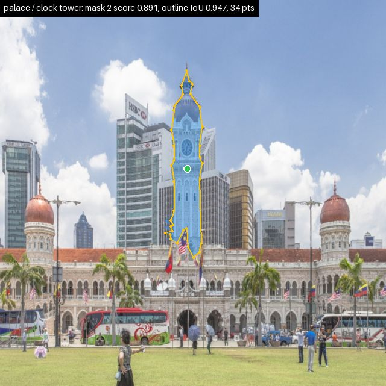
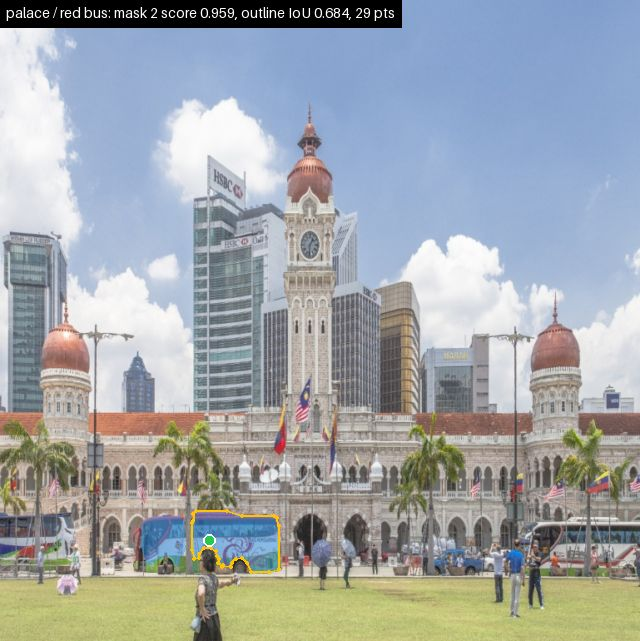
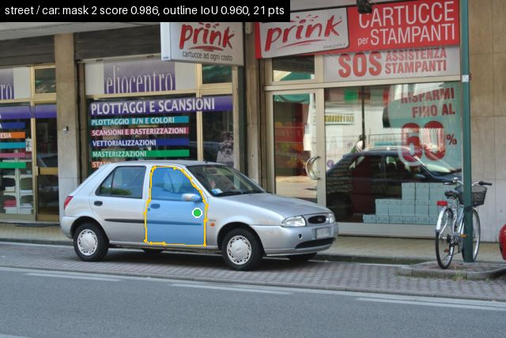
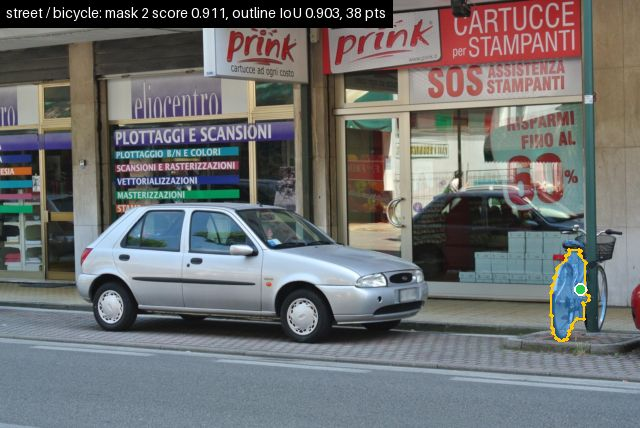
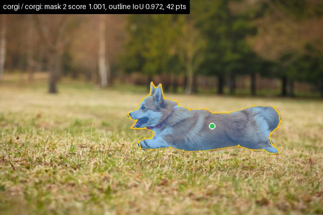
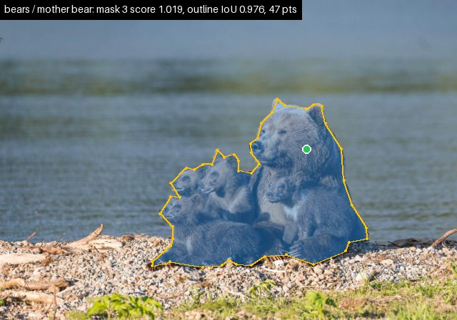
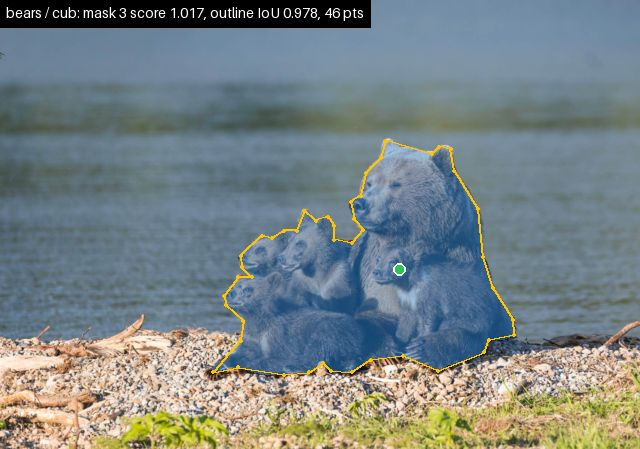
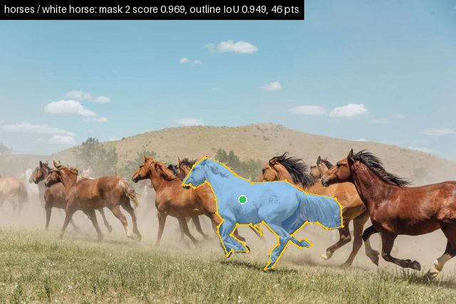
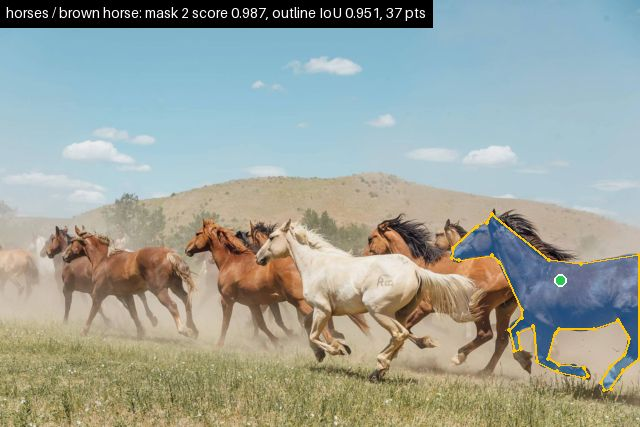
